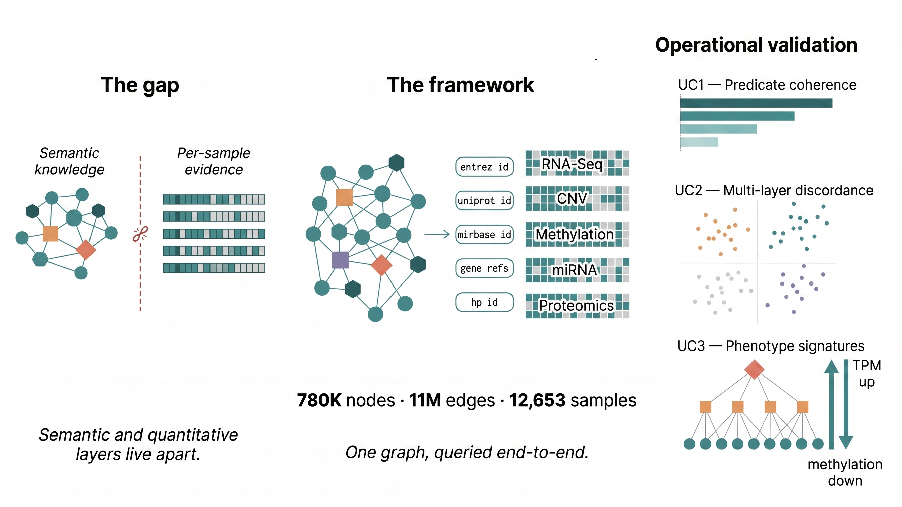

# KG-TransomicNet

[](https://www.python.org) [](https://www.arangodb.com/) [](https://doi.org/10.5281/zenodo.7051238) [](https://portal.gdc.cancer.gov/)  [](https://opensource.org/licenses/MIT)


<!--  
[](https://doi.org/10.5281/zenodo.7051238)
-->

**A Semantic–Quantitative Property-Graph Framework for Dynamic Construction of Knowledge-Based Trans-Omic Networks**

KG-TransomicNet couples a PheKnowLator-derived ontology backbone with per-sample TCGA/TARGET multi-omic measurements inside a single ArangoDB property graph. The semantic layer (≈780k entities, ≈11M typed relations from the OBO Foundry and Relation Ontology) and the quantitative layer (16,938 samples across 42 projects, five omic modalities at native precision) are deterministically joined through controlled mapping keys, so that ontology-grounded queries return per-sample numerical vectors without application-side joins.

The framework is application-agnostic and meant to be reused as the upstream substrate for downstream graph machine-learning pipelines (heterogeneous GNNs, KG embeddings, link prediction).



## What is in the database

Counts below are measured on the materialised instance, not derived from the
upstream phenotype tables (which under-count TARGET and over-count CNV).

| Layer | Source / platform | Projects | Samples | Features/cohort |
|---|---|---:|---:|---:|
| Transcriptomics | STAR TPM | 42 | 15,433 | 60,660 |
| CNV (gene-level) | ASCAT3 | 33 | 10,632 | 60,623 |
| miRNA | miRNA-Seq | 38 | 13,403 | 1,881 |
| Proteomics | RPPA (TCPA) | 32 | 7,904 | 487 |
| Methylation | Illumina HM27 | 13 | 3,137 | 27,578 |
| **Distinct samples (any layer)** | — | **42** | **16,938** | — |

Layer availability is uneven: 11 projects carry all five layers, 22 carry four,
8 carry two or fewer.

Semantic backbone: **780,753 nodes / 11,082,103 edges** from the PheKnowLator instance-based, OWLNETS build.

Full instance: **11.4 GB** — 2.4 GB backbone, 9.0 GB quantitative layers holding
1.70 × 10⁹ measurements in 50,509 per-sample vector documents plus 158 cohort
index documents.

Schema details, collection fields, and the AQL query pattern are documented in [docs/readme_db_structure.md](docs/readme_db_structure.md).

## Requirements

- Python ≥ 3.10
- A running **ArangoDB** instance (≥ 3.11), local or remote — required by every ingestion and use-case script
- Free disk for the full PanCancer build: the finished database is **11.4 GB**,
  but the build needs headroom for the raw downloads and the intermediate JSON.
  Budget **~15 GB** using the per-cohort build of step 3b (which deletes them as
  it goes) or **~29 GB** building everything in one pass.

```bash
pip install -r requiremets.txt
```

Configure the ArangoDB connection (host, credentials, database name) in [scripts/arangodb_utils.py](scripts/arangodb_utils.py) before running any script.

## What ships with the repo and what does not

The repository ships with the **curated identifier-mapping tables** under [data/mappings/](data/mappings/) (BioMart gene mappings, miRNA↔HGNC, RPPA antibody manifest, methylation probe maps, MONDO cross-references, dbSNP rsID checkpoints). The heavy ones are shipped compressed as `.zip` and transparently unzipped on first use; the public probemap files are auto-downloaded from the GDC Xena hub when missing. These tables are **not regenerated by the pipeline** — the scripts under `scripts/mapping/` document how they were produced and are kept for provenance only.

See [data/mappings/README.md](data/mappings/README.md) for the full per-file inventory, provenance details, and the resolution order used by `load_mappings()`.

The following inputs are **not tracked** (see [.gitignore](.gitignore)) and must be obtained externally before running the build:

- **PheKnowLator** instance-based OWLNETS build → [Zenodo 10689968](https://zenodo.org/records/10689968) — place the build under `data/pkt/builds/v3.0.2/`
- **TCGA / TARGET** quantitative layers → [UCSC Xena](https://xenabrowser.net/) and the [GDC Data Portal](https://portal.gdc.cancer.gov/) — downloaded by the scripts in step 1 below

## Reproducing the database

Run the pipeline in order. Every script connects to the ArangoDB instance configured in `scripts/arangodb_utils.py`.

### 1. Download the omic data

```bash
python scripts/download_omics.py                          # TCGA-BRCA test run (default)
python scripts/download_omics.py --cohort tcga            # all TCGA studies
python scripts/download_omics.py --cohort target          # all TARGET studies
python scripts/download_omics.py --cohort all             # TCGA + TARGET
python scripts/download_omics.py --studies TCGA-BRCA TCGA-LUAD   # explicit list
python scripts/download_omics.py --include-probemaps --include-pancan
```

### 2. Build the semantic backbone (PKT → property graph)

```bash
python scripts/download_pkt.py                                  # fetch PKT v3.0.2 from Zenodo + derive NodeLabels CSV
python scripts/build_property_graph.py                          # PKT N-Triples → nodes/edges JSON (full build)
python scripts/build_property_graph.py --sample 10000           # quick test with a random subsample
python scripts/load_graph_to_arangodb.py --db PKT_main          # load nodes/edges into ArangoDB
```

### 3. Build and load the quantitative layers

The build and load steps share the same `--studies` / `--cohort` / `--layers` CLI as `download_omics.py`.

```bash
# Build JSON collections (default: TCGA-BRCA, all layers)
python scripts/build_omics_collections.py
python scripts/build_omics_collections.py --cohort tcga
python scripts/build_omics_collections.py --studies TCGA-BRCA TCGA-LUAD --layers gene_expression mirna

# Load into ArangoDB
python scripts/load_omics_collections_to_arangodb.py --db PKT_main
python scripts/load_omics_collections_to_arangodb.py --cohort tcga --db PKT_main
python scripts/load_omics_collections_to_arangodb.py --studies TCGA-BRCA --layers protein methylation
```

### 3b. Building the whole corpus in one pass (recommended)

Running steps 1–3 with `--cohort all` downloads every project, builds every JSON
collection, then loads: at peak this needs ~29 GB, because the raw matrices, the
intermediate JSON and the database coexist. The JSON stage is the largest of the
three (for TCGA-BRCA: 866 MB raw → 1.5 GB JSON → 770 MB in ArangoDB).

[`scripts/benchmark/run_all_cohorts.py`](scripts/benchmark/run_all_cohorts.py)
runs the three stages **one project at a time** and deletes that project's raw
downloads and intermediate JSON after a successful load, so peak disk stays at
roughly one cohort's working set plus the growing database (~15 GB instead
of ~29 GB). It also times each stage and records what it cost.

```bash
python scripts/benchmark/run_all_cohorts.py --dry-run        # show the plan
python scripts/benchmark/run_all_cohorts.py                  # all remaining projects
python scripts/benchmark/run_all_cohorts.py --studies TCGA-CHOL TCGA-UVM
python scripts/benchmark/run_all_cohorts.py --no-cleanup     # keep raw + JSON
```

Per-project measurements are appended to
`results/benchmark/cohort_ingestion.csv` **after every project**, so an
interrupted run loses nothing and re-running resumes where it stopped. Projects
already recorded as `ok` are skipped.

Two notes for reproducibility:

- The loader defaults to `--db PKT_main`; `run_all_cohorts.py` passes the
  database name explicitly, so set it there if you use a different one.
- `build_omics_collections.py` logs `[OK] finished` and exits 0 even when a
  project raised, so exit status alone is not evidence of success.
  `run_all_cohorts.py` therefore verifies that the expected
  `*_samples_<STUDY>.json` files exist and that vector documents actually
  landed in the database before marking a project done.

Full build on the reference machine (4 cores, 34 GB RAM, ArangoDB 3.11.8):
**42 projects in 231 minutes**, mean 337 s per project (26 s download,
154 s build, 157 s load).

### 4. (Optional) Trans-omic networks and database statistics

```bash
python scripts/build_kg_transomics.py        # per-sample trans-omic subgraph
python scripts/build_transomic_network.py    # cohort-level trans-omic network
python scripts/analyze_kg_transomics.py     # subgraph descriptive statistics
```

## Reproducing the benchmarks

The performance evaluation reported in the paper is produced by four scripts
under [`scripts/benchmark/`](scripts/benchmark/). All of them write CSV to
`results/benchmark/`, together with an `environment.json` recording the machine
and ArangoDB build — without which the timings are not interpretable.

| Script | Measures | Writes |
|---|---|---|
| [`bench_storage.py`](scripts/benchmark/bench_storage.py) | On-disk size and document counts per collection, split into backbone, quantitative layers and support | `storage_footprint.csv` |
| [`bench_query.py`](scripts/benchmark/bench_query.py) | Latency of the three retrieval modalities (semantic step, index dereference, end-to-end traversal), 10 runs after 2 warm-ups, with an optional index ablation | `query_latency.csv`, `index_build_time.csv` |
| [`bench_ingestion.py`](scripts/benchmark/bench_ingestion.py) | Transaction-size sweep on backbone-shaped and vector-shaped documents; ingestion time vs number of samples | `ingestion_batch_sweep.csv`, `ingestion_scaling.csv` |
| [`bench_schema.py`](scripts/benchmark/bench_schema.py) | The same block of measurements materialised under four storage layouts, compared on ingestion time, size and three access patterns | `schema_comparison.csv` |

```bash
pip install python-arango pyarrow psutil

python scripts/benchmark/bench_storage.py
python scripts/benchmark/bench_query.py                    # indexes as deployed
python scripts/benchmark/bench_query.py --create-indexes   # + with/without ablation
python scripts/benchmark/bench_ingestion.py
python scripts/benchmark/bench_schema.py --genes 2000 --kset 200
```

Write experiments run in a scratch database (`BENCH_scratch`) that the scripts
create and drop; the production database is only read from. The one exception is
`bench_query.py --create-indexes`, which creates persistent secondary indexes on
`nodes.bioentity_type`, `nodes.class_code`, `edges.predicate_label` and
`edges.predicate_class_code`; `--drop-created-indexes` removes exactly those and
nothing else.

See [`scripts/benchmark/README.md`](scripts/benchmark/README.md) for the protocol
and the caveats (RocksDB size estimates lag compaction; `cold_first_ms` is a
first-execution proxy, not a flushed cache).

## Reproducing the use cases

The three use cases on TCGA-BRCA exercise the framework at predicate, gene, and phenotype granularity. Each script reads from ArangoDB and writes results + figures to `results/ucN/`.

| Script | What it does |
|---|---|
| [`use_case_1.py`](use_case_1.py) | Predicate-stratified mRNA–mRNA coherence (co-pathway, molecular interaction, genetic interaction, co-disease) vs random baseline; hop-distance decay. |
| [`use_case_2.py`](use_case_2.py) | Per-gene CNV→mRNA→protein discordance classification; GO, pathway, and KG-predicate enrichment on discordant genes. |
| [`use_case_3.py`](use_case_3.py) | Phenotype-anchored two-hop traversal from `HP:0003002` (*Breast carcinoma*); multi-layer projection of the resulting gene set against per-layer random baselines. |

```bash
python use_case_1.py
python use_case_2.py
python use_case_3.py
```

To regenerate only the figures from cached results (no ArangoDB connection needed):

```bash
python use_case_N.py --skip-analysis
```

The classification of output files (R = result, C = plot cache, F = figure) and which files are required by `--skip-analysis` are documented in [use_case_readme.md](use_case_readme.md).

## Repository layout

```
.
├── data/
│   ├── mappings/            # curated identifier-mapping tables (shipped)
│   ├── pkt/                 # PKT build target (external, see above)
│   ├── omics/               # TCGA/TARGET dumps (external)
│   └── ...
├── docs/                    # database schema, layer structure, methods
├── scripts/
│   ├── benchmark/           # performance evaluation + whole-corpus build driver
│   │   ├── run_all_cohorts.py   # per-project download→build→load with cleanup
│   │   ├── bench_storage.py     # storage footprint
│   │   ├── bench_query.py       # query latency + index ablation
│   │   ├── bench_ingestion.py   # transaction-size sweep, ingestion scaling
│   │   ├── bench_schema.py      # comparison against alternative layouts
│   │   └── bench_common.py      # connection, timing and CSV helpers
│   ├── mapping/             # provenance scripts for data/mappings/ (not part of the pipeline)
│   ├── stats/               # database statistics
│   ├── download_omics.py    # fetch TCGA/TARGET layers from UCSC Xena GDC hub
│   ├── download_pkt.py      # fetch PheKnowLator v3.0.2 build from Zenodo + derive NodeLabels CSV
│   ├── omics_utils.py       # read/manipulate locally-downloaded omic matrices
│   ├── pkt_utils.py         # PKT tar/RDF reader helpers
│   ├── build_property_graph.py
│   ├── load_graph_to_arangodb.py
│   ├── build_omics_collections.py
│   ├── load_omics_collections_to_arangodb.py
│   ├── build_kg_transomics.py
│   ├── build_transomic_network.py
│   ├── analyze_kg_transomics.py
│   └── arangodb_utils.py
├── use_case_1.py            # UC1 — predicate-stratified coherence
├── use_case_2.py            # UC2 — multi-layer discordance
├── use_case_3.py            # UC3 — phenotype-anchored subgraph
├── results/                 # per-use-case CSV/JSON results + figures
└── figures/                 # framework architecture figure
```

## Citation

De Filippis, G. M., Rinaldi, A. M. *Modeling Omics with Semantics for Dynamic Construction of Knowledge-Based Trans-Omic Networks.* (under review).

## License

MIT
